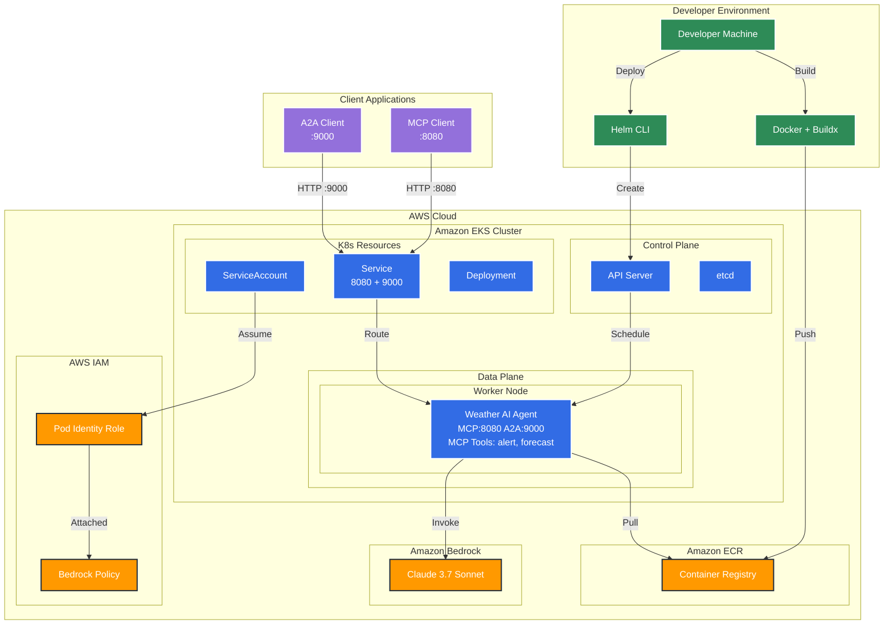

# AI Agents on EKS

A weather assistant built with Strands Agents, MCP (Model Context Protocol), and A2A (Agent to Agent) for providing weather forecasts and alerts.


## Deploy your first AI Agent on EKS

This tutorial will guide you through deploying the Weather Agent to Amazon EKS (Elastic Kubernetes Service) with multi-architecture support and Amazon Bedrock integration.

### Table of Contents

1. [Prerequisites](#prerequisites)
2. [Environment Setup](#environment-setup)
3. [Create EKS Cluster](#create-eks-cluster)
4. [Configure IAM and Bedrock Access](#configure-iam-and-bedrock-access)
5. [Container Registry Setup](#container-registry-setup)
6. [Build and Push Multi-Architecture Image](#build-and-push-multi-architecture-image)
7. [Deploy to Kubernetes](#deploy-to-kubernetes)
8. [Verify Deployment](#verify-deployment)
9. [Access the Weather Agent](#access-the-weather-agent)
10. [Clean Up Resources](#clean-up-resources)

---

### Architecture Overview

The following diagram shows the complete architecture of the Weather Agent deployment on Amazon EKS:



**Key Components:**

- **Dual Protocol Support**: Single pod serves both MCP (port 8080) and A2A (port 9000) protocols
- **EKS Auto Mode**: Automatic node provisioning and management
- **Pod Identity**: Secure access to Amazon Bedrock without storing credentials
- **MCP Protocol**: Standardized interface for AI model communication via HTTP
- **A2A Protocol**: Agent-to-Agent communication for multi-agent workflows
- **Container Registry**: Stores the weather agent container image

---

### Prerequisites

Before starting this tutorial, ensure you have the following tools installed:

- [AWS CLI](https://aws.amazon.com/cli/) (v2.0 or later)
- [eksctl](https://eksctl.io/) (v0.180.0 or later)
- [kubectl](https://kubernetes.io/docs/tasks/tools/) (v1.28 or later)
- [Docker](https://docs.docker.com/get-docker/) with buildx support
- [Helm](https://helm.sh/docs/intro/install/) (v3.0 or later)

**Required AWS Permissions:**
- EKS cluster creation and management
- IAM role and policy management
- ECR repository management
- Amazon Bedrock access

---

### Environment Setup

Set up the required environment variables for the deployment:

```bash
# AWS Configuration
export AWS_ACCOUNT_ID=$(aws sts get-caller-identity --query 'Account' --output text)
export AWS_REGION=us-west-2

# EKS Cluster Configuration
export CLUSTER_NAME=agents-on-eks

# Amazon Bedrock Configuration
export BEDROCK_MODEL_ID=us.anthropic.claude-3-7-sonnet-20250219-v1:0
export BEDROCK_PODIDENTITY_IAM_ROLE=agents-on-eks-bedrock-role

# Kubernetes Configuration
export KUBERNETES_NAMESPACE=default
export KUBERNETES_SERVICE_ACCOUNT=weather-agent
export KUBERNETES_APP_NAME=weather-agent

# ECR Configuration
export ECR_REPO_WEATHER=agents-on-eks/weather-agent
export ECR_REPO_HOST=${AWS_ACCOUNT_ID}.dkr.ecr.${AWS_REGION}.amazonaws.com
export ECR_REPO_URI_WEATHER=${ECR_REPO_HOST}/${ECR_REPO_WEATHER}
```

> **Note:** Make sure you have access to the Amazon Bedrock model `us.anthropic.claude-3-7-sonnet-20250219-v1:0` in your AWS account. You can change the model by updating the `BEDROCK_MODEL_ID` variable.

---

### Create EKS Cluster

Create an EKS cluster with auto mode enabled for simplified management:

```bash
eksctl create cluster --name ${CLUSTER_NAME} --enable-auto-mode
```

This command will:
- Create a new EKS cluster with Kubernetes v1.32
- Enable EKS auto mode for automatic node provisioning
- Set up both AMD64 and ARM64 node support
- Configure the necessary VPC and networking
- Install essential add-ons like metrics-server

**Expected output:**
```
✔ EKS cluster "agents-on-eks" in "us-west-2" region is ready
```

Verify the cluster is running:
```bash
kubectl get nodes
```

---

### Configure IAM and Bedrock Access

#### Step 1: Create IAM Role for Pod Identity

Create an IAM role that allows EKS pods to access Amazon Bedrock:

```bash
aws iam create-role \
  --role-name ${BEDROCK_PODIDENTITY_IAM_ROLE} \
  --assume-role-policy-document '{
    "Version": "2012-10-17",
    "Statement": [
      {
        "Effect": "Allow",
        "Principal": {
          "Service": "pods.eks.amazonaws.com"
        },
        "Action": [
          "sts:AssumeRole",
          "sts:TagSession"
        ]
      }
    ]
  }'
```

#### Step 2: Attach Bedrock Access Policy

Add the necessary permissions for Amazon Bedrock:

```bash
aws iam put-role-policy \
  --role-name ${BEDROCK_PODIDENTITY_IAM_ROLE} \
  --policy-name BedrockAccess \
  --policy-document '{
    "Version": "2012-10-17",
    "Statement": [
      {
        "Effect": "Allow",
        "Action": [
          "bedrock:InvokeModel",
          "bedrock:InvokeModelWithResponseStream"
        ],
        "Resource": "*"
      }
    ]
  }'
```

#### Step 3: Create Pod Identity Association

Link the IAM role to your Kubernetes service account:

```bash
aws eks create-pod-identity-association \
  --cluster ${CLUSTER_NAME} \
  --role-arn arn:aws:iam::${AWS_ACCOUNT_ID}:role/${BEDROCK_PODIDENTITY_IAM_ROLE} \
  --namespace ${KUBERNETES_NAMESPACE} \
  --service-account ${KUBERNETES_SERVICE_ACCOUNT}
```

---

### Container Registry Setup

#### Step 1: Create ECR Repository

Create a private ECR repository for the weather agent image:

```bash
aws ecr create-repository --repository-name ${ECR_REPO_WEATHER}
```

#### Step 2: Authenticate Docker with ECR

Log in to your ECR registry:

```bash
aws ecr get-login-password --region ${AWS_REGION} | \
  docker login --username AWS --password-stdin ${ECR_REPO_HOST}
```

---

### Build and Push Multi-Architecture Image

#### Step 1: Set up Docker Buildx

Create and configure a multi-architecture builder:

```bash
docker buildx create --name multiarch --use
docker buildx use multiarch
```

#### Step 2: Build and Push Multi-Architecture Image

Build the image for both AMD64 and ARM64 architectures:

```bash
docker buildx build \
  --platform linux/amd64,linux/arm64 \
  -t ${ECR_REPO_URI_WEATHER}:latest \
  --push .
```

This command will:
- Build the image for both x86_64 and ARM64 architectures
- Create a multi-architecture manifest
- Push the image directly to ECR

#### Step 3: Verify Multi-Architecture Support

Confirm the image supports both architectures:

```bash
docker manifest inspect ${ECR_REPO_URI_WEATHER}:latest
```

You should see entries for both `linux/amd64` and `linux/arm64`.

---

### Deploy to Kubernetes

Deploy the weather agent using Helm:

```bash
helm upgrade ${KUBERNETES_APP_NAME} helm --install \
  --set serviceAccount.name=${KUBERNETES_SERVICE_ACCOUNT} \
  --set image.repository=${ECR_REPO_URI_WEATHER} \
  --set image.pullPolicy=Always \
  --set image.tag=latest
```

This will:
- Create the necessary Kubernetes resources
- Deploy the weather agent with the correct service account
- Configure the MCP server to run on port 8080

---

### Verify Deployment

#### Step 1: Check Pod Status

Verify the pod is running successfully:

```bash
kubectl rollout status deployment/${KUBERNETES_APP_NAME}
kubectl get pods -l app.kubernetes.io/instance=${KUBERNETES_APP_NAME}
```
> **Note:** Takes 3 minutes to provision a new node

Expected output:
```
Waiting for deployment "weather-agent" rollout to finish: 0 of 1 updated replicas are available...
NAME                            READY   STATUS    RESTARTS   AGE
weather-agent-xxxxxxxxx-xxxxx   1/1     Running   0          2m
```

#### Step 2: Check Application Logs

View the weather agent logs:

```bash
kubectl logs deployment/${KUBERNETES_APP_NAME}
```

You should see:
```
INFO - Starting Weather Agent Dual Server...
INFO - MCP Server will run on port 8080 with streamable-http transport
INFO - A2A Server will run on port 9000
```

#### Step 3: Verify Service

Check that the service endpoints for MCP(8080) and A2A(9000) is created:

```bash
kubectl get ep ${KUBERNETES_APP_NAME}
```

---

### Access the Weather Agent

#### MCP: Port Forward (Development) as MCP server

Forward the MCP server port to your local machine:

```bash
kubectl port-forward service/${KUBERNETES_APP_NAME} 8080:mcp
```

Now you can connect with the MCP client to `http://localhost:8080`.

Use the MCP Inspector to test the connection:

```bash
npx @modelcontextprotocol/inspector
```

In the UI, use:
- **Transport:** streamable-http
- **URL:** http://localhost:8080/mcp


#### A2A: Port Forward (Development) as A2A server

Forward the MCP server port to your local machine:

```bash
kubectl port-forward service/${KUBERNETES_APP_NAME} 9000:a2a
```

Now you can connect with the A2A client to `http://localhost:9000`.

Use the test a2a client script
```bash
uv run test_a2a_client.py
```

---

### Clean Up Resources

When you're done with the tutorial, clean up the resources to avoid charges:

#### Step 1: Uninstall the Application

```bash
helm uninstall ${KUBERNETES_APP_NAME}
```

#### Step 2: Delete ECR Repository

```bash
aws ecr delete-repository --repository-name ${ECR_REPO_WEATHER} --force
```

#### Step 3: Delete EKS Cluster

```bash
eksctl delete cluster --name ${CLUSTER_NAME}
```

#### Step 4: Delete IAM Role and Policies

```bash
# Delete the inline policy
aws iam delete-role-policy \
  --role-name ${BEDROCK_PODIDENTITY_IAM_ROLE} \
  --policy-name BedrockAccess

# Delete the IAM role
aws iam delete-role --role-name ${BEDROCK_PODIDENTITY_IAM_ROLE}
```

---

### Troubleshooting

| Issue | Solution |
|-------|----------|
| `exec format error` | Ensure you built a multi-architecture image with `--platform linux/amd64,linux/arm64` |
| Pod stuck in `CrashLoopBackOff` | Check logs with `kubectl logs <pod-name>` and verify Bedrock permissions |
| Image pull errors | Verify ECR authentication and repository permissions |
| Health check failures | Check that the MCP server is running on port 8080 |

### Next Steps

- Integrate the weather agent with your applications using MCP
- Set up monitoring and alerting for the deployment
- Configure ingress for external access
- Implement CI/CD pipelines for automated deployments

## CONTRIBUTING

#### Prerequisites

Ensure you have the following configured
```bash
export AWS_ACCESS_KEY_ID=<key here>
export AWS_SECRET_ACCESS_KEY=<access key here>
export AWS_SESSION_TOKEN=<session here>
```

#### Install dependencies
```bash
uv sync
```

#### Run interactive mode
```bash
uv run interactive
```

#### Run as mcp server streamable-http or stdio
```bash
uv run mcp-server --transport streamable-http
```

Connect your mcp client such as `npx @modelcontextprotocol/inspector` then in the UI use streamable-http with http://localhost:8080/mcp

#### Run as a2a server
```bash
uv run agent_a2a_server.py
```

#### Run the a2a client
```bash
uv run test_a2a_client.py
```

#### Running in a Container

Build the container using docker
```bash
docker build . --tag agent
```
Build the container using finch
```bash
finch build . --tag agent
```

Run the agent interactive
```bash
docker run -it \
-v $HOME/.aws:/app/.aws \
-e AWS_REGION=${AWS_REGION} \
-e AWS_ACCESS_KEY_ID=${AWS_ACCESS_KEY_ID} \
-e AWS_SECRET_ACCESS_KEY=${AWS_SECRET_ACCESS_KEY} \
-e AWS_SESSION_TOKEN=${AWS_SESSION_TOKEN} \
agent interactive
```
Type a question, to exit use `/quit`


Run the agent as mcp server
```bash
docker run \
-v $HOME/.aws:/app/.aws \
-p 8080:8080 \
-e AWS_REGION=${AWS_REGION} \
-e AWS_ACCESS_KEY_ID=${AWS_ACCESS_KEY_ID} \
-e AWS_SECRET_ACCESS_KEY=${AWS_SECRET_ACCESS_KEY} \
-e AWS_SESSION_TOKEN=${AWS_SESSION_TOKEN} \
-e DEBUG=1 \
agent mcp-server
```
Connect your mcp client such as `npx @modelcontextprotocol/inspector` then in the UI use streamable-http with http://localhost:8080/mcp

Run the agent as a2a server
```bash
docker run \
-v $HOME/.aws:/app/.aws \
-p 9000:9000 \
-e AWS_REGION=${AWS_REGION} \
-e AWS_ACCESS_KEY_ID=${AWS_ACCESS_KEY_ID} \
-e AWS_SECRET_ACCESS_KEY=${AWS_SECRET_ACCESS_KEY} \
-e AWS_SESSION_TOKEN=${AWS_SESSION_TOKEN} \
-e DEBUG=1 \
agent a2a-server
```
Then test in another terminal running `uv run test_a2a_client.py`


Run the agent as multi-server mcp and a2a
```bash
docker run \
-v $HOME/.aws:/app/.aws \
-p 9000:9000 \
-e AWS_REGION=${AWS_REGION} \
-e AWS_ACCESS_KEY_ID=${AWS_ACCESS_KEY_ID} \
-e AWS_SECRET_ACCESS_KEY=${AWS_SECRET_ACCESS_KEY} \
-e AWS_SESSION_TOKEN=${AWS_SESSION_TOKEN} \
-e DEBUG=1 \
agent agent
```
Use mcpinspector or a2a client to test
